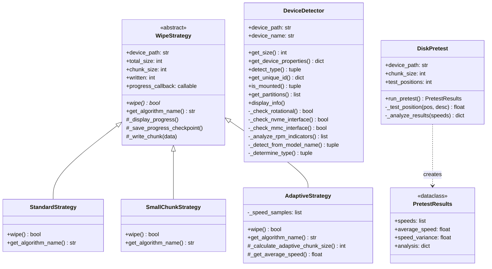
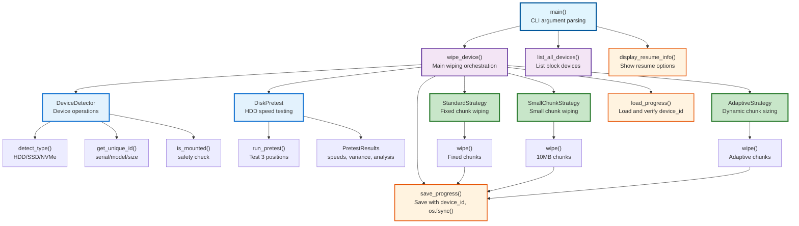

# Architecture Documentation

**⚠️ WARNING: This tool is EXTREMELY DESTRUCTIVE and will PERMANENTLY DESTROY data! ⚠️**

## Function Structure and Call Relationships

This document provides an overview of the wipeit codebase architecture, showing the function structure and call relationships.

**🚨 USE AT YOUR OWN RISK - ALL DATA WILL BE IRREVERSIBLY DESTROYED! 🚨**

### Architecture Overview

The wipeit codebase follows a modern, modular architecture with:
- **Source Package Structure**: All source code organized under `src/`
- **One File Per Class**: Each class in its own dedicated file
- **Object-Oriented Design**: Strategy pattern for wiping algorithms, encapsulated device detection
- **Procedural Functions**: Core functionality exposed through functions
- **Clear Separation**: Device detection, wiping strategies, pretesting, and CLI separated
- **Centralized Constants**: All application constants in `global_constants.py`

### File Structure

```
src/
├── __init__.py                    # Package initialization, version
├── global_constants.py            # All application constants (sizes, thresholds)
├── device_detector.py             # DeviceDetector class (device operations)
├── disk_pretest.py                # DiskPretest class, PretestResults dataclass
├── wipe_strategy.py               # WipeStrategy classes (Strategy pattern)
│   ├── WipeStrategy (abstract base)
│   ├── StandardStrategy
│   ├── SmallChunkStrategy
│   └── AdaptiveStrategy
├── wipeit.py                      # Main functions and CLI interface
├── test_wipeit.py                 # Main tests (148 tests)
├── test_device_detector.py        # DeviceDetector tests
└── test_wipe_strategy.py          # Strategy tests
```

**Key Design Principles:**
- **One File Per Class**: Each class gets its own dedicated file
- **Strategy Pattern**: Wiping algorithms as interchangeable strategies
- **Dataclasses**: Type-safe data structures (PretestResults)
- **Package Organization**: Logical grouping under `src/`
- **Clear Imports**: Explicit imports, centralized constants
- **Separation of Concerns**: Detection, testing, strategies, and CLI separated

### Class Hierarchy



### Strategy Pattern: Wiping Algorithms

The core wiping functionality uses the **Strategy Pattern**, allowing different algorithms to be selected at runtime based on disk characteristics:

1. **WipeStrategy (Abstract Base Class)**
   - Defines common interface and shared functionality
   - Handles progress display, checkpointing, and chunk writing
   - Subclasses implement specific `wipe()` algorithms

2. **StandardStrategy**
   - Fixed chunk size throughout operation
   - Default for SSDs and when pretest not performed
   - Simple, predictable performance

3. **SmallChunkStrategy**
   - Caps chunk size at 10MB (MAX_SMALL_CHUNK_SIZE)
   - Selected for slow HDDs (< 50 MB/s average)
   - Better responsiveness on slow drives

4. **AdaptiveStrategy**
   - Dynamic chunk sizing based on disk position
   - Tracks speed samples and adjusts chunks
   - Selected for HDDs with high speed variance
   - Optimizes for varying speeds (outer vs inner tracks)

**Algorithm Selection Logic:**
```python
if disk_type == "HDD" and pretest_performed:
    if pretest.average_speed < LOW_SPEED_THRESHOLD_MBPS:
        use SmallChunkStrategy
    elif pretest.speed_variance > HIGH_VARIANCE_THRESHOLD:
        use AdaptiveStrategy
    else:
        use StandardStrategy
else:
    use StandardStrategy
```

### Main Architecture Flow



### Component Descriptions

#### **1. DeviceDetector Class**
**Purpose**: Encapsulates all device detection and information operations

**Public Methods**:
- `get_size()` - Get device size in bytes via blockdev/ioctl
- `get_device_properties()` - Get udev properties (serial, model, etc.)
- `detect_type()` - Detect HDD/SSD/NVMe/eMMC with confidence level
- `get_unique_id()` - Get device identifiers (serial, model, size) for resume verification
- `is_mounted()` - Check if device or partitions are mounted
- `get_partitions()` - Get partition information via lsblk
- `display_info()` - Display comprehensive device information

**Private Methods**:
- `_check_rotational()` - Check sysfs rotation flag
- `_check_nvme_interface()` - Check if device is NVMe
- `_check_mmc_interface()` - Check if device is eMMC/SD
- `_analyze_rpm_indicators()` - Analyze RPM keywords in properties
- `_detect_from_model_name()` - Detect type from model string
- `_determine_type()` - Synthesize all indicators into final type
- `_display_*()` - Display formatting methods

**Device ID Verification**:
- `get_unique_id()` returns `{'serial': ..., 'model': ..., 'size': ...}`
- Used in `load_progress()` to verify correct device on resume
- Prevents accidental wrong-device wipes
- Program halts with clear error if device mismatch detected

#### **2. WipeStrategy Classes (Strategy Pattern)**
**Purpose**: Implement different wiping algorithms

**Abstract Base Class: WipeStrategy**
- Defines common interface: `wipe()`, `get_algorithm_name()`
- Shared functionality: progress display, checkpointing, chunk writing
- Tracks: `written`, `last_milestone`, `written_since_last_save`
- Callback mechanism for progress saves

**StandardStrategy**
- Fixed chunk size throughout operation
- Simple, predictable performance
- Default for SSDs

**SmallChunkStrategy**
- Caps chunk size at 10MB
- For slow HDDs (< 50 MB/s)
- Better responsiveness

**AdaptiveStrategy**
- Dynamic chunk sizing based on position
- Tracks speed samples
- For HDDs with high variance
- Optimizes for outer vs inner tracks

**Progress Tracking**:
- Each strategy tracks `written_since_last_save`
- Calls `progress_callback()` when `>= PROGRESS_SAVE_THRESHOLD` (100MB)
- Ensures progress saves regardless of chunk size alignment

#### **3. DiskPretest Class**
**Purpose**: Test HDD write speeds at different positions

**Methods**:
- `run_pretest()` - Execute pretest, return PretestResults
- `_test_position(pos, desc)` - Test single position, return speed
- `_analyze_results(speeds)` - Analyze speeds, recommend algorithm

**PretestResults Dataclass**:
- `speeds: list[float]` - Speeds at each test position
- `average_speed: float` - Average speed in MB/s
- `speed_variance: float` - Speed variance
- `analysis: dict` - Recommended algorithm and reason

**Pretest Process**:
1. Test beginning (5% into disk)
2. Test middle (50% into disk)
3. Test end (95% into disk)
4. Calculate average speed and variance
5. Recommend algorithm based on thresholds

#### **4. Progress Management**
**Purpose**: Save and restore wipe progress

**Key Functions**:
- `save_progress()` - Save progress with device_id, use os.fsync() for immediate persistence
- `load_progress()` - Load and verify device_id matches current device
- `clear_progress()` - Remove progress file
- `get_progress_file()` - Returns `'wipeit_progress.json'` (single file for all devices)
- `find_resume_files()` - Find existing progress file
- `display_resume_info()` - Show resume options at startup

**Progress File Format**:
```json
{
  "device": "/dev/sdb",
  "written": 1142947840,
  "total_size": 320072933376,
  "progress_percent": 0.357,
  "chunk_size": 104857600,
  "timestamp": 1760224401.27,
  "pretest_results": {...},
  "device_id": {
    "serial": "VFM201R2E81GYN",
    "model": "Hitachi_HDT725032VLA360",
    "size": 320072933376
  }
}
```

**Safety Features**:
- Device ID verification on resume prevents wrong-device wipes
- `os.fsync()` ensures progress survives crashes
- Saves every 100MB (PROGRESS_SAVE_THRESHOLD)
- Single progress file: `wipeit_progress.json`

#### **5. Global Constants (global_constants.py)**
**Purpose**: Centralized application constants

**Categories**:
- Size multipliers: `KILOBYTE`, `MEGABYTE`, `GIGABYTE`
- Defaults: `DEFAULT_CHUNK_SIZE`, `MAX_SMALL_CHUNK_SIZE`
- Thresholds: `LOW_SPEED_THRESHOLD_MBPS`, `HIGH_VARIANCE_THRESHOLD`
- Progress: `MILESTONE_INCREMENT_PERCENT` (5%), `PROGRESS_SAVE_THRESHOLD` (100MB)
- Timeouts: `PROGRESS_FILE_EXPIRY_SECONDS`
- Display: `DISPLAY_LINE_WIDTH`

**Benefits**:
- Single source of truth for all constants
- Easy to tune performance parameters
- Prevents magic numbers in code
- Improves maintainability

### Key Design Patterns

1. **Strategy Pattern**: Wiping algorithms are interchangeable strategies selected at runtime based on disk characteristics.

2. **Object-Oriented Encapsulation**: `DeviceDetector`, `DiskPretest`, and `WipeStrategy` classes encapsulate related operations with clean interfaces.

3. **Dataclasses**: `PretestResults` provides type-safe, immutable data structures.

4. **Template Method**: `WipeStrategy` base class defines algorithm skeleton, subclasses implement specific steps.

5. **Callback Pattern**: Progress callbacks decouple strategy execution from progress persistence.

6. **Progressive Enhancement**: Starts with basic wiping, adds intelligent features (detection, pretesting, adaptive algorithms).

7. **Resume Capability**: Progress saved at 100MB intervals with device verification for safe resume.

8. **Adaptive Algorithms**: Pretest results drive algorithm selection for optimal performance.

9. **Separation of Concerns**: Detection, testing, strategies, progress, and CLI cleanly separated.

10. **Method Decomposition**: Complex operations broken into focused, testable methods.

11. **Error Handling**: Comprehensive error handling with graceful degradation and informative messages.

12. **Immediate Persistence**: `os.fsync()` ensures critical progress data survives crashes.

### Function Categories

#### **Entry Point**
- `main()` - CLI argument parsing and orchestration

#### **Classes**
- `DeviceDetector` - Device detection and information
- `DiskPretest` - HDD speed testing
- `WipeStrategy` - Abstract base for wiping algorithms
- `StandardStrategy` - Fixed chunk wiping
- `SmallChunkStrategy` - Small chunk wiping
- `AdaptiveStrategy` - Dynamic chunk sizing

#### **Core Functions**
- `wipe_device()` - Main wiping orchestration
- `get_block_device_size()` - Get device size

#### **Progress Management**
- `save_progress()` - Save with device_id and os.fsync()
- `load_progress()` - Load and verify device_id
- `clear_progress()` - Remove progress file
- `get_progress_file()` - Get progress filename
- `find_resume_files()` - Find available progress
- `display_resume_info()` - Show resume options

#### **Utility Functions**
- `parse_size()` - Convert size strings to bytes
- `list_all_devices()` - List available block devices

### Testing Architecture

**Test Files**:
- `test_wipeit.py` - Main functionality tests (95 tests)
- `test_device_detector.py` - DeviceDetector tests (14 tests)
- `test_wipe_strategy.py` - Strategy tests (48 tests)

**Total**: 157 tests with 95% coverage

**Test Categories**:
- Unit tests with comprehensive mocking
- Integration tests for end-to-end flows
- Strategy pattern tests across all implementations
- Progress tracking and resume tests
- Device ID verification tests
- Error handling and edge case tests

### Performance Characteristics

**Benchmark Results** (298GB HDD):
- StandardStrategy: ~1.5-2 hours
- SmallChunkStrategy: ~2-2.5 hours (better responsiveness)
- AdaptiveStrategy: ~1.5-2 hours (optimal for varying speeds)

**Progress Tracking**:
- Saves every 100MB (PROGRESS_SAVE_THRESHOLD)
- Maximum progress loss: 100MB on crash
- Immediate disk flush with `os.fsync()`

**Algorithm Selection**:
- Pretest takes 3-5 seconds
- Saves significant time by choosing optimal algorithm
- Adaptive strategy can improve performance by 10-20% on HDDs

### Safety Mechanisms

1. **Mount Safety**: Refuses to wipe mounted devices
2. **Device Verification**: Checks device ID on resume
3. **Progress Persistence**: `os.fsync()` guarantees disk writes
4. **User Confirmation**: Requires explicit 'y' to proceed
5. **Clear Warnings**: Prominent warnings throughout
6. **Graceful Interrupts**: Ctrl+C saves progress properly
7. **Error Messages**: Detailed error messages with recovery instructions

### Future Architecture Considerations

**Potential Enhancements**:
- Parallel wiping for multi-device operations
- Additional strategies (parallel writes, pattern-based)
- Enhanced pretest with more test positions
- Progress reporting via REST API
- Web UI for monitoring
- Verification pass after wiping
- Multiple wipe passes (DOD 5220.22-M)

**Backward Compatibility**:
- Legacy functions maintained as wrappers
- Old progress files ignored (device-specific names)
- Graceful handling of missing device IDs
