# Architecture Documentation

**⚠️ WARNING: This tool is EXTREMELY DESTRUCTIVE and will PERMANENTLY DESTROY data! ⚠️**

## Function Structure and Call Relationships

This document provides an overview of the wipeit codebase architecture, showing the function structure and call relationships.

**🚨 USE AT YOUR OWN RISK - ALL DATA WILL BE IRREVERSIBLY DESTROYED! 🚨**

### Architecture Overview

The wipeit codebase follows a hybrid architecture combining:
- **Object-Oriented Design**: New `DeviceDetector` class for device operations
- **Procedural Functions**: Legacy functions maintained for backward compatibility
- **Modular Structure**: Clear separation between device detection, progress management, and core wiping

### Class-Based Architecture (New)

```mermaid
graph TD
    %% DeviceDetector Class
    DeviceDetector["DeviceDetector Class<br/>Encapsulates all device operations"]
    
    %% Public Methods
    get_size["get_size()<br/>Get device size in bytes"]
    get_device_properties["get_device_properties()<br/>Get udev properties"]
    detect_type["detect_type()<br/>Detect HDD/SSD/NVMe/eMMC"]
    is_mounted["is_mounted()<br/>Check mount status"]
    get_partitions["get_partitions()<br/>Get partition information"]
    display_info["display_info()<br/>Display comprehensive device info"]
    
    %% Private Helper Methods
    _check_rotational["_check_rotational()<br/>Check if device is rotational"]
    _check_nvme_interface["_check_nvme_interface()<br/>Check NVMe interface"]
    _check_mmc_interface["_check_mmc_interface()<br/>Check MMC interface"]
    _analyze_rpm_indicators["_analyze_rpm_indicators()<br/>Analyze RPM indicators"]
    _detect_from_model_name["_detect_from_model_name()<br/>Detect from model name"]
    _determine_type["_determine_type()<br/>Determine final device type"]
    _display_header["_display_header()<br/>Display info header"]
    _display_basic_info["_display_basic_info()<br/>Display basic device info"]
    _display_type_info["_display_type_info()<br/>Display type information"]
    _display_partition_info["_display_partition_info()<br/>Display partitions"]
    _display_mount_status["_display_mount_status()<br/>Display mount status"]
    
    %% Class relationships
    DeviceDetector --> get_size
    DeviceDetector --> get_device_properties
    DeviceDetector --> detect_type
    DeviceDetector --> is_mounted
    DeviceDetector --> get_partitions
    DeviceDetector --> display_info
    
    %% detect_type calls
    detect_type --> _check_rotational
    detect_type --> _check_nvme_interface
    detect_type --> _check_mmc_interface
    detect_type --> _analyze_rpm_indicators
    detect_type --> _determine_type
    
    %% _determine_type calls
    _determine_type --> _detect_from_model_name
    
    %% display_info calls
    display_info --> _display_header
    display_info --> _display_basic_info
    display_info --> _display_type_info
    display_info --> _display_partition_info
    display_info --> _display_mount_status
    
    %% Styling
    classDef classNode fill:#e3f2fd,stroke:#1976d2,stroke-width:3px
    classDef publicMethod fill:#f3e5f5,stroke:#4a148c,stroke-width:2px
    classDef privateMethod fill:#fff3e0,stroke:#e65100,stroke-width:2px
    
    class DeviceDetector classNode
    class get_size,get_device_properties,detect_type,is_mounted,get_partitions,display_info publicMethod
    class _check_rotational,_check_nvme_interface,_check_mmc_interface,_analyze_rpm_indicators,_detect_from_model_name,_determine_type,_display_header,_display_basic_info,_display_type_info,_display_partition_info,_display_mount_status privateMethod
```

### Function Call Graph (Legacy + New)

```mermaid
graph TD
    %% Entry Point
    main["main()<br/>Entry point - CLI argument parsing"]

    %% DeviceDetector Class (New)
    DeviceDetector["DeviceDetector Class<br/>Object-oriented device operations"]
    
    %% Legacy Functions (Backward Compatibility)
    get_device_info["get_device_info(device)<br/>DEPRECATED - Use DeviceDetector"]
    detect_disk_type["detect_disk_type(device)<br/>DEPRECATED - Use DeviceDetector"]
    check_device_mounted["check_device_mounted(device)<br/>DEPRECATED - Use DeviceDetector"]

    %% Core Functions
    list_all_devices["list_all_devices()<br/>List all available devices"]
    get_block_device_size["get_block_device_size(device)<br/>Get device size in bytes"]
    perform_hdd_pretest["perform_hdd_pretest(device, chunk_size)<br/>Test HDD write speeds at different positions"]

    %% Progress Management
    get_progress_file["get_progress_file(device)<br/>Get progress file path"]
    save_progress["save_progress(device, written, total_size, chunk_size, pretest_results)<br/>Save wipe progress to file"]
    load_progress["load_progress(device)<br/>Load saved progress from file"]
    clear_progress["clear_progress(device)<br/>Clear progress file"]
    find_resume_files["find_resume_files()<br/>Find all progress files"]
    display_resume_info["display_resume_info()<br/>Display available resume options"]

    %% Core Wiping Function
    wipe_device["wipe_device(device, chunk_size, resume, skip_pretest)<br/>Main wiping function"]

    %% Utility Functions
    parse_size["parse_size(size_str)<br/>Parse size strings (e.g., '100M', '1G')"]

    %% Main function calls
    main --> display_resume_info
    main --> list_all_devices
    main --> parse_size
    main --> get_device_info
    main --> load_progress
    main --> clear_progress
    main --> wipe_device

    %% Legacy wrapper calls (backward compatibility)
    get_device_info --> DeviceDetector
    detect_disk_type --> DeviceDetector
    check_device_mounted --> DeviceDetector

    %% wipe_device calls
    wipe_device --> get_block_device_size
    wipe_device --> detect_disk_type
    wipe_device --> load_progress
    wipe_device --> perform_hdd_pretest
    wipe_device --> save_progress

    %% Progress management calls
    save_progress --> get_progress_file
    load_progress --> get_progress_file
    clear_progress --> get_progress_file
    display_resume_info --> find_resume_files
    find_resume_files --> get_progress_file

    %% Styling
    classDef entryPoint fill:#e1f5fe,stroke:#01579b,stroke-width:3px
    classDef classNode fill:#e3f2fd,stroke:#1976d2,stroke-width:3px
    classDef coreFunction fill:#f3e5f5,stroke:#4a148c,stroke-width:2px
    classDef utilityFunction fill:#e8f5e8,stroke:#1b5e20,stroke-width:2px
    classDef progressFunction fill:#fff3e0,stroke:#e65100,stroke-width:2px
    classDef deprecatedFunction fill:#ffebee,stroke:#c62828,stroke-width:2px,stroke-dasharray: 5 5

    class main entryPoint
    class DeviceDetector classNode
    class wipe_device,perform_hdd_pretest coreFunction
    class parse_size,get_block_device_size,list_all_devices utilityFunction
    class save_progress,load_progress,clear_progress,get_progress_file,find_resume_files,display_resume_info progressFunction
    class get_device_info,detect_disk_type,check_device_mounted deprecatedFunction
```

### Function Categories

#### **Entry Point**
- `main()` - CLI argument parsing and orchestration

#### **Object-Oriented Classes (New)**
- `DeviceDetector` - Encapsulates all device detection and information operations
  - **Public Methods**: `get_size()`, `get_device_properties()`, `detect_type()`, `is_mounted()`, `get_partitions()`, `display_info()`
  - **Private Methods**: `_check_rotational()`, `_check_nvme_interface()`, `_check_mmc_interface()`, `_analyze_rpm_indicators()`, `_detect_from_model_name()`, `_determine_type()`, `_display_*()` methods

#### **Core Functions**
- `wipe_device()` - Main wiping logic with disk type detection and algorithm selection
- `perform_hdd_pretest()` - Test HDD write speeds to optimize algorithm selection

#### **Legacy Functions (Backward Compatibility)**
- `get_device_info()` - **DEPRECATED** - Use `DeviceDetector(device).display_info()` instead
- `detect_disk_type()` - **DEPRECATED** - Use `DeviceDetector(device).detect_type()` instead
- `check_device_mounted()` - **DEPRECATED** - Use `DeviceDetector(device).is_mounted()` instead

#### **Progress Management**
- `save_progress()` - Save wipe progress and pretest results
- `load_progress()` - Load saved progress for resume operations
- `clear_progress()` - Remove progress files
- `get_progress_file()` - Generate progress file paths
- `find_resume_files()` - Discover available resume files
- `display_resume_info()` - Show resume options to user

#### **Utility Functions**
- `parse_size()` - Convert size strings to bytes
- `get_block_device_size()` - Get device size using system calls
- `list_all_devices()` - List available block devices

### Key Design Patterns

1. **Object-Oriented Encapsulation**: The new `DeviceDetector` class encapsulates all device-related operations, providing a clean interface and internal state management.

2. **Backward Compatibility**: Legacy functions are maintained as thin wrappers around the new class methods, ensuring existing code continues to work without modification.

3. **Progressive Enhancement**: The system starts with basic wiping and adds intelligent features (disk detection, pretesting) for optimal performance.

4. **Resume Capability**: Progress is saved at regular intervals, allowing interrupted wipes to be resumed.

5. **Adaptive Algorithms**: HDD pretesting enables selection of optimal wiping strategies based on actual device performance.

6. **Separation of Concerns**: Device information, progress management, and core wiping logic are cleanly separated into distinct function groups and classes.

7. **Method Decomposition**: Complex operations are broken down into smaller, focused methods (e.g., `detect_type()` uses 6 helper methods).

8. **Error Handling**: Comprehensive error handling with graceful degradation and informative error messages.
