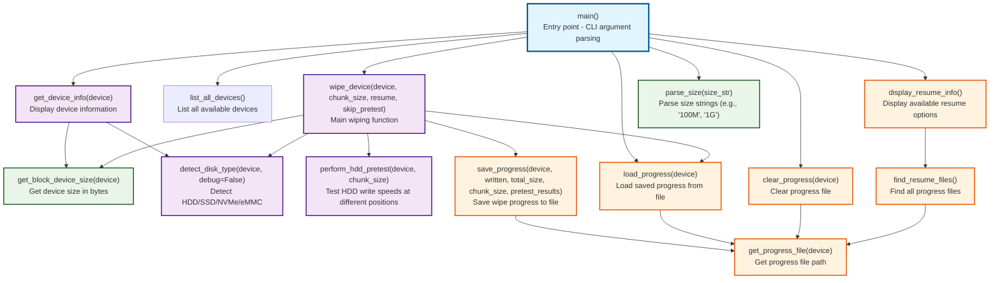

# Architecture Documentation

**⚠️ WARNING: This tool is EXTREMELY DESTRUCTIVE and will PERMANENTLY DESTROY data! ⚠️**

## Function Structure and Call Relationships

This document provides an overview of the wipeit codebase architecture, showing the function structure and call relationships.

**🚨 USE AT YOUR OWN RISK - ALL DATA WILL BE IRREVERSIBLY DESTROYED! 🚨**

### Function Call Graph

### Function Categories

#### **Entry Point**
- `main()` - CLI argument parsing and orchestration

#### **Core Functions**
- `wipe_device()` - Main wiping logic with disk type detection and algorithm selection
- `get_device_info()` - Display comprehensive device information
- `detect_disk_type()` - Identify storage device type (HDD/SSD/NVMe/eMMC)
- `perform_hdd_pretest()` - Test HDD write speeds to optimize algorithm selection

#### **Progress Management**
- `save_progress()` - Save wipe progress and pretest results
- `load_progress()` - Load saved progress for resume operations
- `clear_progress()` - Remove progress files
- `get_progress_file()` - Generate progress file paths
- `find_resume_files()` - Discover available resume files
- `display_resume_info()` - Show resume options to user

#### **Utility Functions**
- `parse_size()` - Convert size strings to bytes
- `get_block_device_size()` - Get device size using system calls
- `list_all_devices()` - List available block devices

### Key Design Patterns

1. **Progressive Enhancement**: The system starts with basic wiping and adds intelligent features (disk detection, pretesting) for optimal performance.

2. **Resume Capability**: Progress is saved at regular intervals, allowing interrupted wipes to be resumed.

3. **Adaptive Algorithms**: HDD pretesting enables selection of optimal wiping strategies based on actual device performance.

4. **Separation of Concerns**: Device information, progress management, and core wiping logic are cleanly separated into distinct function groups.
